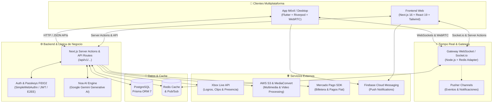

# 🌐 Trewly Social Platform — Análisis Integral del Ecosistema

**La red social de nueva generación que une gaming, comunidad, mensajería en tiempo real y personalización total.**

**[Soporte y Comunidad](https://trewly.me/c/trewly)** • **[Política de Privacidad](https://trewly.me/privacy)** • **[Términos de Servicio (ToS)](https://trewly.me/tos)**

---

## 🏛️ Arquitectura del Sistema

---

## 📖 Visión General del Ecosistema

**Trewly** es un ecosistema multiplataforma (Web y Móvil/Desktop) de **red social híbrida de nueva generación** que fusiona:
1. **Gaming Hub & Showcase:** Integración profunda con plataformas de videojuegos (Xbox Live, Steam, etc.) para exhibir perfiles gamers, logros, estadísticas, clips y capturas.
2. **Red Social Enriquecida:** Feed interactivo estilo X/Threads, historias efímeras (Stories), videos verticales (Shorts), hilos y blogs.
3. **Mensajería Instantánea & Llamadas:** Chat en tiempo real, cifrado extremo a extremo (E2EE), notas de voz con espectrograma interactivo, videollamadas WebRTC con CallKit nativo.
4. **Customización Profunda (Espíritu Retro-Moderno):** Perfiles personalizables estilo SpaceHey/MySpace con música de perfil, temas de color personalizados, marcos de avatar animados, insignias y vitrinas.
5. **Economía Virtual & Gamificación:** Billetera digital (`Wallet`), mercado (`Market`), inventario de cosméticos, sistema de crafteo (`Crafting`) y suscripciones Premium.
6. **IA Nativa (`Noa AI`):** Asistente inteligente integrado para soporte, creación y asistencia al usuario.
7. **Trewly Dating:** Módulo de citas integrado con sistema de *swipe* geolocalizado con mapas interactivos.

---

## 🛠️ 1. Stack Tecnológico

### 📱 Aplicación Móvil / Desktop (`trewly_mobile`)
* **Framework:** [Flutter](https://flutter.dev/) (Dart 3.9+ / Material 3).
* **Multiplataforma Nativa:** Android, iOS, Windows (instalador MSIX y ejecutable de escritorio), macOS y Linux.
* **Gestión de Estado & Arquitectura:** `flutter_riverpod` (Riverpod 2.5+), Clean Architecture modular por *features*.
* **Enrutamiento:** `go_router` con navegación declarativa profunda.
* **Llamadas & Audio en Tiempo Real:** `flutter_webrtc` (WebRTC), `flutter_callkit_incoming` (pantalla de llamada nativa estilo iOS/Android), `record`, `audio_waveforms`, `just_audio`.
* **Cifrado & Seguridad:** `sodium_libs` (cifrado libsodium / E2EE), `passkeys` (autenticación biométrica WebAuthn), `flutter_secure_storage`, `screen_protector`.
* **Tiempo Real & Notificaciones:** `pusher_channels_flutter`, `socket_io_client`, `firebase_messaging` (FCM) y `flutter_local_notifications`.
* **Multimedia & Animaciones:** `video_player`, `gal` (guardado en galería), `croppy` / `image_cropper`, `lottie`, `flutter_animate`, `photo_view`, `cached_network_image`.
* **Geolocalización & Mapas:** `mapbox_maps_flutter`, `geolocator`, `geocoding`, `appinio_swiper` (Swipe Cards).
* **Inteligencia Artificial Local:** `google_mlkit_language_id` (detección y traducción de idiomas on-device).

---

### 🌐 Aplicación Web Fullstack (`trewly-web`)
* **Framework Web:** [Next.js 16](https://nextjs.org/) (App Router) + [React 19](https://react.dev/) + TypeScript.
* **Estilos & UI:** [Tailwind CSS v4](https://tailwindcss.com/), [Shadcn UI](https://ui.shadcn.com/), [Radix UI](https://www.radix-ui.com/), `lucide-react`, Glassmorphism con `liquid-glass-react`.
* **3D & Animaciones Web:** `three`, `@react-three/fiber`, `@react-three/drei`, `framer-motion`, `@lottiefiles/dotlottie-react`.
* **Base de Datos & ORM:** PostgreSQL con [Prisma ORM 7](https://www.prisma.io/) (esquema relacional avanzado con más de 2400 líneas de modelos).
* **Backend en Tiempo Real & Gateway:** Node.js, `gateway.js`, Socket.io con Redis Adapter (`@socket.io/redis-adapter`, `ioredis`), Pusher.
* **Procesamiento Multimedia:** AWS S3, AWS Elemental MediaConvert, `fluent-ffmpeg` y `ffmpeg-static`.
* **Seguridad & Auth:** SimpleWebAuthn (`@simplewebauthn/server` / `browser` para Passkeys biométricos FIDO2), JWT (`jose`, `jsonwebtoken`), Firebase Admin, reCAPTCHA v3.
* **Pasarela de Pago:** Mercado Pago SDK (`mercadopago`).
* **Editor Enriquecido:** TipTap (`@tiptap/react` con extensiones de imágenes, enlaces y Markdown).

---

## 🧩 2. Módulos y Funcionalidades Clave

### 🎮 A. Gaming Hub & Showcase (Especialidad Xbox & Gamers)
* **Perfil Gamer:** Vinculación de Gamertag, Avatar Xbox y Gamerscore en vivo.
* **Vitrina de Logros:** Visualización de logros desbloqueados y bloqueados, con tarjetas de detalle (*Sheets* modales) con fecha, puntos G, descripción y porcentaje de desbloqueo.
* **Visualizador de Capturas & Clips:** 
  * Galería de capturas de pantalla y grabaciones de juego en alta definición.
  * Modal inmersivo con badge interactivo (*Clip de Juego* / *Captura*), fecha en español, contador y botón de descarga directa a galería.
  * Reproductor de video personalizado con barra de progreso, control de volumen/mute y tiempo exacto.
  * **Modo Fullscreen Horizontal:** Apertura en orientación horizontal inmersiva que sincroniza la reproducción y permite volver al modal sin perder el estado.
* **Integración de Juegos:** Detección de títulos jugados recientemente y estadísticas de tiempo de juego (`howlongtobeat`).

---

### 💬 B. Mensajería Instantánea & Llamadas (Trewly Messenger)
* **Chat Privado y Grupal:** Mensajes en tiempo real con confirmación de lectura, estados en línea y escritura.
* **Notas de Voz:** Grabación interactiva con ondas de audio dinámicas (`audio_waveforms`) y reproducción acelerada (1x, 1.5x, 2x).
* **Seguridad Avanzada:** Capa de cifrado extremo a extremo (E2EE) con libsodium.
* **Llamadas de Voz y Video (WebRTC):** 
  * Integración con `flutter_callkit_incoming` para recibir llamadas incluso con la app cerrada como una llamada nativa del teléfono.
  * Señalización WebRTC en tiempo real para baja latencia y alta calidad de audio/video.

---

### 📰 C. Red Social & Contenido Multimedia
* **Feed Social (Muro):** Publicaciones con texto enriquecido, menciones `@`, hashtags `#`, encuestas, GIFs, imágenes múltiples y videos.
* **Interacciones:** Reacciones personalizadas, comentarios anidados en hilos, citas (*Quote Posts*) y reposts.
* **Traducción Automática:** Detección de idioma con IA y traducción en un clic.
* **Historias (Stories):** Formato efímero de 24 horas con texto, fotos, filtros y lista de visualizaciones.
* **Shorts:** Feed de desplazamiento vertical infinito para videos cortos al estilo Reels/TikTok con comentarios y likes instantáneos.
* **Reproductor de Música en el Perfil:** Permite a cada usuario fijar una canción destacada en su perfil con carátula animada y reproducción en segundo plano.

---

### 🎨 D. Personalización, Economía & Tienda
* **Editor de Perfil Avanzado:**
  * Recorte de avatar circular 1:1 nativo.
  * Selector de temas de colores (fondo, acento, textos) para personalizar el perfil.
* **Inventario & Cosméticos:** Marcos de avatar animados, insignias de perfil, banners exclusivos y efectos de hover.
* **Mercado (`Market`):** Compra y venta de cosméticos entre usuarios.
* **Crafteo (`Crafting`):** Fusión y creación de nuevos ítems digitales.
* **Billetera Virtual (`Wallet`):** Gestión de saldo, transacciones fiat (Mercado Pago), historial de movimientos y tokens de intercambio.

---

### ❤️ E. Trewly Dating
* **Encuentros & Citas:** Módulo de descubrimiento de personas basado en geolocalización.
* **Tarjetas de Swipe:** Deslizar perfiles con gestos fluidos (`appinio_swiper`).
* **Mapas & Filtros:** Radio de distancia, intereses en común y mapas con `mapbox_maps_flutter`.
* **Match & Chat:** Apertura de conversaciones exclusivas tras hacer match mutuo.

---

### 🤖 F. Inteligencia Artificial (`Noa AI`)
* Asistente conversacional inteligente alimentado por Google Gemini (`@google/generative-ai`) y servicios de backend para responder preguntas, resumir contenido y asistir a los usuarios dentro de la plataforma.

---

### 🛡️ G. Seguridad, Identidad & Plataforma Desarrolladores
* **Passkeys Biométricos:** Inicio de sesión ultra rápido y seguro mediante huella/FaceID/Windows Hello sin contraseñas (FIDO2 / WebAuthn).
* **2FA & Verificación:** Códigos de un solo uso (TOTP/SMS), verificación de identidad y badges oficiales (Gobierno, Empresa, Creador verificado).
* **Portal de Desarrolladores & OAuth2:** Creación de aplicaciones y bots de terceros mediante el flujo OAuth2 estándar (`/developers`, `/oauth`).
* **Sistema de Moderación:** Centro de reportes, strikes comunitarios y panel de auditoría.

---

## 📊 Resumen Comparativo de Plataformas

| Característica | Web (`trewly-web`) | Móvil / Desktop (`trewly_mobile`) |
| :--- | :--- | :--- |
| **Tecnología Base** | Next.js 16 + React 19 + TypeScript | Flutter 3.9+ / Dart |
| **Público / Formato** | Navegadores escritorio & móviles | Android APK, iOS IPA, Windows EXE/MSIX |
| **Tiempo Real** | Socket.io / Redis + Pusher | Pusher Channels + WebSockets |
| **Llamadas WebRTC** | Enlace web / navegador | CallKit nativo + WebRTC Móvil |
| **Gaming Hub (Xbox)** | Showcase Web con widgets | Modales nativos con fullscreen horizontal y descargas |
| **Seguridad** | WebAuthn Browser + Next Auth / JWT | Passkeys nativos + Sodium E2EE + Secure Storage |
| **Monetización** | Mercado Pago Web Checkout | Wallet in-app + Pasarela integrada |
